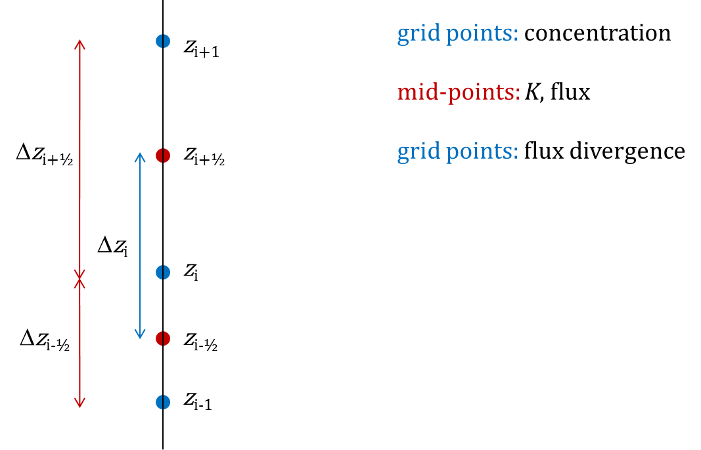
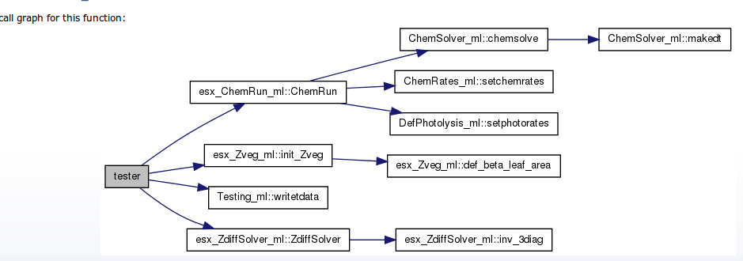

ESX (Ecosystem surface exchange) f90/f95 code
=============================================

Quick start
===========

Once compiled (type 'make' on unix systems ), the code esx_tester can be configured via the config_esx.nml file. This 'namelist' file allows the user to change many of the basic variables of ESX. All variables have default settings Changing settings, so config_esx.nml .....  in that  file is also a good introduction to the ESX model itself. Here we explain the various settings in config_esx.nml

.. include:: config_esx.rst

OLDER COMMENTS FOLLOW. NEEDS UPDATE
===================================

Challenges
----------

A basic difficulty is that ESX is intended for flexible use, with the link to chemical transport models (CTMs) providing the greatest difficulty. In such models ESX needs to called for each grid-cell, typically every 20 minutes or so. The CTM might call ESX for several differents sets of land-cover within the same grid cell, e.g. forests, grassland, or water. We might want different canopy configurations for each of these land-covers, with possibly many canopy layers in a forest, but only air-layers over water.  

Future users of ESX will certainly want to use different methods to those chosen in the initial phases, so we need to plan for this.

ESX code is therefore arranged with a view to this type of future use in CTMs, and for other scientists. This means collecting bits of related code in f90 modules. These modules can then in future be expanded and improved as needed. As an example, the LAI setting is now set using a beta function, which could have been compactly coded with a few lines of code.  The most general call would probably be something such as set_LAI(), and somehow we will have to figure out that today we want a beta function with a=10, b=4. 

Many basic decisions had to be taken about where we keep data, e.g.:

	* Do we have one file "esx_Variables" where we keep all data?  Or do we use lots of small topic-oriented modules. 

	* How do we avoide cross-dependencies betwen modules? For example, if we store gsto in Zveg_ml, themn this depends on meteorology, which might be stored in Zmet_ml. But some meteorology (e.g. PAR levels) will depend on vegetation, so functions in Zveg_ml might need functions in Zmet_ml, and vice-versa. The solution I have implemented now keeps base-data separate from functions. This avoids such cross-dependencies, but is less topic-modular  than I would have liked.

	* Do we keep data as scalars or arrays? (So far I am inclined to use arrays, to match the 1-D structure of both ESX and the EMEP chemical system). 

	* How do we separate EMEP 1-D arrays, which cover the whole troposphere, from ESX arrays if we try to use the same chemical solvers? 

	* Do we arrange some namespace approach, e.g. EMEP(:)%t and ESX(:)%t for temperature, and let the solvers work with with e.g. Zcol(:)%t where Zcol can point to either EMEP or ESX for grass of ESX for water, etc.  (I did start with that idea, but the code looked too messy. Still, this feels like the most general solution.)

Link to EMEP model, and "CM" files, ZCM directories
----------------------------------------------------

We should try to maximise the common use of modules between the EMEP CTM and ESX. Most importantly, the files with prefix "CM" are the chemical mechanism files as used in the EMEP model. Actually, we use a pre-processor (GenChem.pl) to create these for different chemical mechanisms. A 12-reaction CM has been created for ESX testing. Usually the input files used by GenChem to create CM files for a given mechanism (e.g. ESX_r12)  are kept in the appropriate ZCM directory:

I have found some problems already though with the original CM files, and have hard-coded some changes. These changes need to be re-written into GenChem once we have a set of CM files that works with both ESX and EMEP. (I will change the EMEP model to be compatable with  EMEP as we work. With EMEP though, CPU time is *very* important, so I need to take care.)

Some other files should be common to both codes, e.g.:

    ChemSolver.f90

    PhysicalConstants

Some files have the same function calls as EMEP, but MPI coding has been stripped from the ESX version to avoid dependency propblems:

    ChemFunctions.f90

    CheckStops

    ModelConstants

Documentation?
==============

Well, you are reading this ;-)
This file is written in plain text as README.rst using simple rst conventions. Run rst2pdf on this and you will get README.pdf.

This README is also probably the simplest way to get an overview of the code and some basic explanations. We can also use it as a working document, to help explain the code to each other.  Hopefully this will gradually morph into a decent user guide.

Also, for those wanting loads of detail and fancy web-sites:

There are two automatic systems implemented in the sub-directories Docs_Doxy and Docs_f90docs. Scripts in those sub-directories create html files (and for doxygen also latex files). Run whichever you prefer and possibly both. Just now I don't know which is best, f90doc is simpler, doxygen gives more. The code-changes needed are quite similar in both, and it might be possible to keep both systems. Needs more research/checking.

1) Doxygen

  Doxygen works rather easily to produce HTML and latex, with call-graphs, and the ability to use latex to write real equations ;-)

  Doxygen produces loads of detail though, the output is for programmers rather than casual users.  Still, we have started to introduce some Doxygen conventions into the code (the comments starting with !> or !!).

  The configuation file Doxyf90Graph is in the ESX/Docs_Doxy directory. Those that want to can create the documentation in this directory by simply running "doxygen Doxyf90Graph" (needs doxygen and graphviz), or even simpler by running mk.doxy and that will call firefox too.

2)  f90docs

  Very simple system. Run mk.f90docs from the Docs_f90docs sub-directory, and it will start up firefox with the html files. f90doc recognises !! for comments, but maybe this can be configured for consistency with doxygen.

Structure
=========

From Juha-Pekka:

With:

	z = height of layer mid-points from ground (main grid points), e.g. 1 m, 3 m, 5 m,...

	zbnd = height of layer boundaries from ground, e.g. 2 m, 4 m,... (the lowest layer would be 0-2m)
           (was zMid in JPs notation and first ESX code.)

	dz = layer depths, dz1=zMid1, dz2=zMid2-zMid1,..., e.g. 2 m, 2 m,...

	dzMid = distance between grid points, dzMid1=z2-z1..., e.g. 2 m, 2 m,...

	Concentration is defined at z, K at zbnd, flux at zbnd, flux divergence at z.

The lowest zbnd corresponds to z1½. At z½, no K is defined, as the flux is determined by the boundary condition.

Code Outline
=============

The ESX code has default settings, but is mainly configured from the namelist file, config_esx.nml.
Here the user can set z-levels, species which are dispersed, some plot settings, etc. 

The driving code (here esx_tester.f90) reads config_esx.nml to get the array z.levels
(currently the cell mid-points), and then the esx_Zgrid_ml looks after
allocating arrays and setting e.g. dz appropriately. This minimises
I hope the number of things which need to be set by the user.

esx_tester.f90 runs the following subroutines::

    call init_Zgrid(zlevels)      !> z, zmid, nz...

    call init_Zveg(hVeg,LAI,io=6) !> dLAI, cumLAI

    call init_Zmet(zlevels)       !> temp (tzK), rhz, ..

    call init_Zchem( msg)         !> xChem, rcemis, ..

    call def_Kz(zmid, "an_sol_c2")

With some selected code as::

   t = 0.0  ! start time

   dt = 1.0 ! seconds in advec time-step

   do while(.true.)

        call ZdiffSolver(nzlev,dt, Vd,Ve, Fb=0.0,Ft=0.0, &
           D=S1, E=S0, concn=cz, fixedBC=.true., debug=debug_flag ) ! NDT=1 here

        if ( t > evaltimes(nevalt) ) then
         czt(:, nevalt) = cz(:)
         print "(i3,f15.3,3es12.3)", nevalt, evaltimes(nevalt), cz(1), xChem(O3,1), xChem(NO,1)
         nevalt = nevalt + 1
        end if
   end do
   call ChemRun()
   call writetdata(IO_RES,"CN-Solm2",  evaltimes, z,  czt( :, :) )

The ZdiffSolver runs the Crank-Nicholson scheme, intended to reproduce Juha-Pekka's matlab code. 
The ChemRun call isn't doing much yet, but very soon it will run chemistry. This needs
to be inside the time-loop of course, we just need to out how to implement the operator splitting.
Any DOSE related modules also have to be placed inside the time-loop.

esx_Zgrid_ml.f90::

  public ::  Init_zgrid   ! allocates arrays, ine values
  public ::  test_zgrid   ! testing subroutine

provides variables such as z, zmid, dz, etc., plus those which will be essential in any implementation - Kz, .......

esx_Zveg_ml.f90:: 

  public  :: init_Zveg           !> allocated Zveg variables
  private :: beta                !> beta function
  public  :: def_beta_leaf_area  !> defines LAI using beta function
  public  :: def_gleaf           !> defines conductances
  public ::  def_rad_prof
  public  :: test_Zveg           !> testing subroutine

esx_Zmet_ml.f90::

  public ::  init_Zmet  ! allocates arrays, sets initial(fake) values
  public ::  test_Zmet  ! 

- sets z-dependent meteorology, rhz, pz, tzK,...

esx_Zchem_ml.f90 ::

  public :: init_zchem
  
contains basic chemical arrays: xChem(nspec, k), Dchem(), rct(), rcemis

Kz_ml.f90::

  public :: def_kz
  public :: def_kz_pow
  public :: print_Kz

collection of routines to get Kz profile. Simple ones so
far from Juha-Pekka, can be extended with full (e.g. EMEP)
profiles  later.  Still need to implement latest code

esx_ZdiffSolver_ml.f90::

  public  :: ZdiffSolver
  private :: inv_3diag

solves vertical diffusion equation using Crank-Nicholson. Intended to mimic JP's code.

esx_ChemRun_ml.f90::

  public :: ChemRun

ChemSolver_ml.f90::

  public  :: chemsolve        ! Runs chemical solver

DefPhotolysis_ml.f90::

  public :: setphotorates

provides simple photolysis rates (from MCM code)

CM_ChemDims_ml.f90::

     ,NRCT = 9             &!! No. rate coefficients
     ,NSPEC_TOT = 14       &!! No. species (total)
     ,NSPEC_ADV = 9        &!! No. advected species
     ,NSPEC_SHL = 5         !! No. short-lived species

CM_ChemSpecs_ml.f90::

  ...
  ,  O3          =   6   &
  ,  NO          =   7   &
  ,  NO2         =   8   &
  ...
  public :: define_chemicals 

indices and other basic chemical characteristics 

ChemFunctions_ml.f90::

  public ::  kaero     ! aerosol production rate
  public ::  kmt3      ! For 3-body reactions

Stripped-down equivalent of EMEP code

CM_reactions1.inc::

      !-> O3
      P =   rct(1,k) * xnew(OP )
      L =  rct(3,k)* xnew(NO )  + rcphot(IDBO3)
      xnew(O3)=  ( xold(O3) + dt2 * P) /(1.0 + dt2*L )

Lists of chemical equations.

CheckStop_ml.f90::

  public :: CheckStop

with: subroutine CheckStop(logic, txt), so we can do e.g.
call checkstop( O3>1.0e6, "Way too much O3"). In the EMEP code we have loads of options for 
this, and the call runs stop on all processors.

Compilation
===========

The Makefile is produced using the include perl script (makegf90), after which we simply run make:

	* makegf90 esx_tester.f90 > Makefile

	* make

Makefile  - so far assumes gfortran, and "pedantic" compilation to help catch errors early. Simply edit makegf90 to use other compilers.  Compiles with -fdefault-real-8 (or -r8 for intel) to make all reals into double-precision. In future we should consider using some more modern f90 real(kind=dp) approach, but this needs to be consistent with EMEP too.

This system and the code have so far been tested with

	* gfortran (gcc 4.6.1) on Linux mint PC system

	* gfortran (gcc 4.4.7) on stallo HP supercomputer

	* ifort 13.0.1 on stallo

Known problems
==============
        
	* Not much is working yet.....

